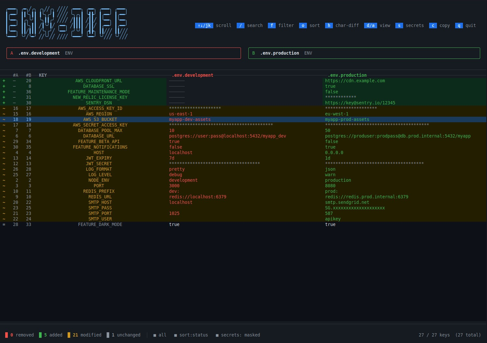

# env-diff

A fully **offline**, local TUI tool to visually diff `.env`, `.yaml`, and `.json` config files side-by-side — with color-coded diffs, inline character-level highlighting, and automatic secret masking.

[](https://nodejs.org)
[](https://raw.githubusercontent.com/m-elbably/env-diff/master/LICENSE)



## Why?

When you need to compare your development and production environment files, most approaches require you to paste secrets into a web UI, browser extension, or send them to an AI/LLM API. **env-diff is 100% local** — your credentials, tokens, and API keys never leave your machine.

Built with **Bun**, **TypeScript**, and **OpenTUI** (React reconciler).

---

## Features

- **Side-by-side comparison** of two files in the terminal
- **Supports `.env`, `.yaml`/`.yml`, and `.json`** — fully recursive key flattening (dot notation for nested keys)
- **Color-coded diff rows:**
  - 🔴 **Removed** — key only in file A
  - 🟢 **Added** — key only in file B
  - 🟡 **Modified** — key in both, different values
  - ⚫ **Unchanged** — identical
- **Inline character-level diff** on modified values — highlights exactly which characters changed (toggleable)
- **Automatic secret masking** — keys matching patterns like `*_KEY`, `*_SECRET`, `*_TOKEN`, `*_PASSWORD`, `*_AUTH`, etc. are shown as `*****` by default
- **Line number columns** (#A / #B) so you can jump directly to the right line in your editor
- **Search / filter** — type to filter keys by name in real-time
- **Filter by status** — show only added, removed, modified, or unchanged keys
- **Sort options** — by status, alphabetical, or by original file order
- **Copy to clipboard** — copy the selected value to your system clipboard
- **Exit code 1** when differences are found — enables use in CI pipelines

---

## Installation

Requires [Bun](https://bun.sh).

```bash
git clone <repo>
cd env-diff
bun install
```

Run directly:
```bash
bun run src/index.tsx <file-a> <file-b>
```

Or install globally:
```bash
bun link
env-diff <file-a> <file-b>
```

---

## Usage

```bash
env-diff [options] <file-a> <file-b>
```

### Examples

```bash
# Compare .env files
env-diff .env.development .env.production

# Compare YAML configs (GCP App Engine, docker-compose, etc.)
env-diff app.staging.yaml app.production.yaml

# Compare JSON configs
env-diff config.staging.json config.production.json

# Mix file types
env-diff .env app.yaml

# Ignore CI/pipeline-specific keys
env-diff --ignore-pattern 'CI_|GITHUB_|BUILD_' .env .env.production
```

### Options

| Flag | Description |
|------|-------------|
| `--ignore-pattern <regex>` | Skip keys matching this regex (case-insensitive) |
| `-h`, `--help` | Show usage |

---

## Keyboard Shortcuts

| Key | Action |
|-----|--------|
| `↑` / `k` | Scroll / move cursor up |
| `↓` / `j` | Scroll / move cursor down |
| `Ctrl+U` / `PgUp` | Half page up |
| `Ctrl+D` / `PgDn` | Half page down |
| `g` / `Home` | Jump to top |
| `G` / `End` | Jump to bottom |
| `/` | Open search — type to filter keys by name |
| `Escape` | Clear active search |
| `f` | Cycle status filter: all → removed → added → modified → unchanged |
| `d` | Show differences only |
| `a` | Show all keys |
| `o` | Cycle sort order: status → alphabetical → file A order → file B order |
| `h` | Toggle inline character-level diff highlighting |
| `s` | Toggle secret masking (reveal / hide `*****` values) |
| `c` | Copy selected row's value to clipboard |
| `q` | Quit |

---

## Exit Codes

| Code | Meaning |
|------|---------|
| `0` | Files are identical |
| `1` | Differences were found |

This makes `env-diff` usable in CI scripts:

```bash
env-diff .env.ci .env.production
if [ $? -ne 0 ]; then
  echo "WARNING: CI env differs from production"
fi
```

---

## Secret Masking

Keys whose names match any of the following patterns are automatically masked as `*****`:

`key` · `secret` · `token` · `password` · `passwd` · `pwd` · `private` · `auth` · `credential` · `cert` · `salt` · `hash` · `bearer`

Press `s` to reveal all values temporarily. Masking is re-applied when you press `s` again or restart.

---

## Supported File Formats

| Format | Notes |
|--------|-------|
| `.env` | Comments, quoted values (`"..."` / `'...'`), inline comments stripped |
| `.yaml` / `.yml` | Full nested key flattening via dot notation (e.g. `env_variables.DB_HOST`) |
| `.json` | Full nested key flattening, same dot notation |

Mixed-type comparisons work (e.g. `.env` vs `.yaml`).

---

## Project Structure

```
src/
├── index.tsx          # CLI entry point, argument parsing
├── parser.ts          # .env / .yaml / .json parsing + line number tracking
├── diff.ts            # Diff computation, character-level diff (LCS)
└── ui/
    ├── App.tsx        # Root TUI component, keyboard handling, all state
    ├── Header.tsx     # ASCII title, shortcut badges, file pills
    ├── DiffTable.tsx  # Side-by-side key/value table with inline diff
    ├── StatusBar.tsx  # Stats footer with active filter/sort/secrets state
    └── theme.ts       # Color palette
```

#### License
MIT

